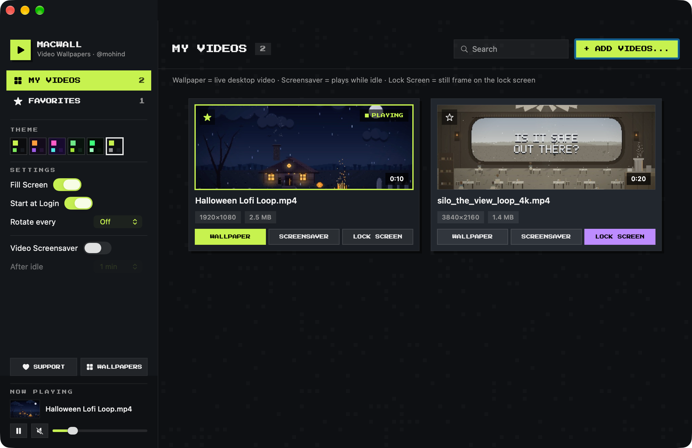
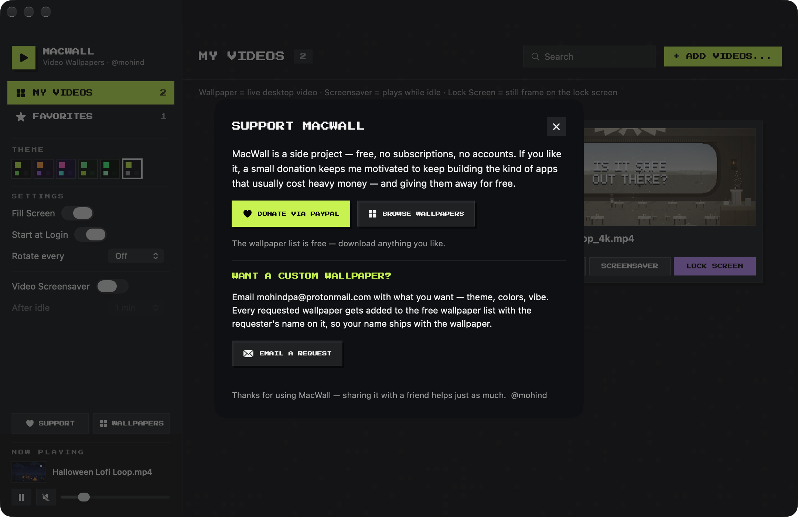
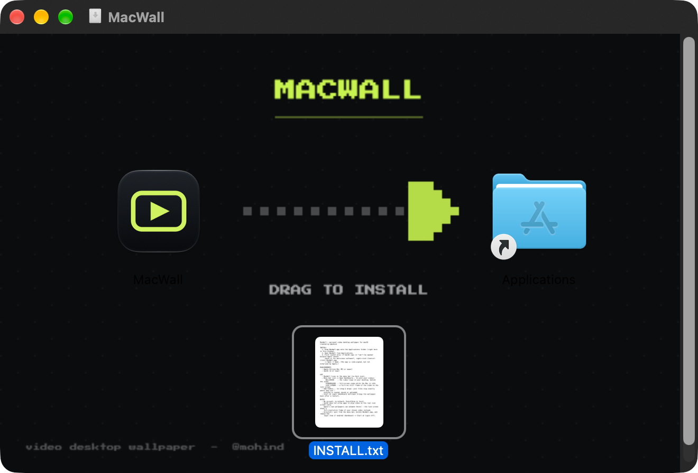

# MacWall — personal video desktop wallpaper (macOS)

Created by @mohind.

**Download:** [**MacWall.dmg** from the latest release](https://github.com/mohindpa/macwall/releases/latest) — one file, drag to Applications. This repo is the source; build it yourself with [Build & install](#build--install).

A real installed Mac app (**menu bar only — no Dock icon**) that plays a looping
video as your desktop wallpaper — behind the desktop icons, on every Space.
**Your own videos are the library.** Files are never copied, moved or modified;
MacWall only remembers where they live.




## Build & install

```bash
bash build.sh            # builds build/MacWall.app (compiles Sources/, makes the icon once)
bash build.sh --install  # installs to ~/Applications (menu bar app — no Dock icon)
bash scripts/make_dmg.sh # builds MacWall.dmg — the shareable single-file installer
```

## Share it

`MacWall.dmg` is the whole app in one file — open it, drag **MacWall** onto
**Applications**, done. The mounted window is styled with the pixel-art drag
background and includes an `INSTALL.txt` with the one-time Gatekeeper note:
on another Mac the first launch needs right-click → **Open**, because the app
is signed but not Apple-notarized.

## Use

Reach the dashboard from the menu bar icon (**Open Dashboard…**, ⌘D); reopening
the app while it runs also brings it up:

- **Dashboard** — sidebar with **My Videos** and **Favorites**, a grid of your
  videos (real thumbnails, duration, resolution, size), search, and
  **Add Videos…** (multi-select). Click **Set as Wallpaper**, double-click a
  card, or use the right-click menu. Drag & drop video files anywhere in the
  window to import them.
- **Now Playing** (bottom of the sidebar) — pause/resume, mute, volume.
- **Theme** (sidebar) — 6 animated pixel-art themes: Lime Pixel, Halloween,
  Vaporwave, Forest, Terminal, Classic. Click a swatch.
- **Settings** (sidebar) — Fill Screen, Start at Login, Rotate every 5–60 min,
  **Video Screensaver** on/off + **After idle** (1–30 min)
- **Menu bar icon** — same actions as before; **Open Dashboard…** (⌘D).
- Reopening the app while it runs (Launchpad/Spotlight) brings up the dashboard.
- Finder → right-click a video → **Open With → MacWall**.

## Dashboard themes

The dashboard is itself animated pixel art: each theme is a palette plus a
scene drawn on a 6 pt grid with SwiftUI `Canvas`, ticking at 8 fps
(`PixelClock`, a separate ObservableObject so the video cards never re-render).
Scenes: a cottage with flickering windows + drifting clouds (Lime Pixel,
Halloween with pumpkins), fireflies in pines (Forest), a striped retro sun
over a moving perspective grid (Vaporwave), falling pixel rain + blinking
cursor (Terminal); Classic is a calm static background. Scanlines are drawn
over every scene. The chunky UI font is bundled **Press Start 2P** (OFL),
registered via `ATSApplicationFontsPath` in Info.plist — if the .ttf is ever
missing the UI falls back to the system font automatically. Switch themes from
the sidebar swatches, the menu bar (**Dashboard Theme**), or CLI
`--theme <key>`; the choice is remembered in `themeKey`.

## Which video plays where

Every card has three buttons at the bottom — click to toggle (or use the
card's right-click menu):

- **WALLPAPER** — play this video as the live desktop wallpaper.
- **SCREENSAVER** — play it when the Mac sits idle. Unlit = follow the
  wallpaper video.
- **LOCK SCREEN** — a full-res still frame of this video becomes the macOS
  wallpaper — exactly what the lock screen displays. (macOS gives apps no way
  to animate the real lock screen: setting a video file as wallpaper is
  accepted but renders as a flat color on macOS 26, so MacWall exports a
  frame instead. Your original wallpapers are backed up first and restored
  when you switch LOCK SCREEN off.)

Also in the menu bar: **Screensaver Video** / **Lock Screen Video (still)**.
CLI: `--saver-video <path|same>`, `--lock-video <path|off>`.

## Video screensaver

When the Mac sits idle for the chosen time, MacWall covers every screen with
the same video — full-screen, above the menu bar and Dock, and it swallows
input so nothing behind it gets clicked. Any input dismisses it. The system
lock screen and macOS's own screen saver always win: MacWall steps aside
automatically (it hides when the session locks). Toggle + delay live in the
dashboard Settings and the menu bar. Nothing in System Settings has to change.

## CLI (for testing / automation)

```bash
build/MacWall.app/Contents/MacOS/MacWall --print-state
build/MacWall.app/Contents/MacOS/MacWall --set-video ~/Downloads/clip.mp4
build/MacWall.app/Contents/MacOS/MacWall --login on|off|status
build/MacWall.app/Contents/MacOS/MacWall --screensaver on|off|status|preview|<minutes>
build/MacWall.app/Contents/MacOS/MacWall --theme lime|halloween|vaporwave|forest|terminal|classic
build/MacWall.app/Contents/MacOS/MacWall --saver-video <path|same>
build/MacWall.app/Contents/MacOS/MacWall --lock-video <path|off>
build/MacWall.app/Contents/MacOS/MacWall --support              # open the Support panel
build/MacWall.app/Contents/MacOS/MacWall --wallpaper-list <url> # set the public wallpaper-list link (or: off)
```

## Support & custom wallpapers

The Support panel (sidebar → ♥ **SUPPORT**, menu bar → **Support MacWall…**,
or `--support`) contains:

- **Donate via PayPal** → `paypal.com/donate` to `mohindpa@protonmail.com`
  ("side project — donations keep the premium-grade stuff free").
- **Browse wallpapers** → the free wallpaper list at
  `https://macwallmac.vercel.app` — compiled into the app (`Support.swift`),
  re-pointable at runtime with `--wallpaper-list <url>`.
- **Email a request** → `mailto:` to `mohindpa@protonmail.com`; the panel
  tells users every requested wallpaper joins the free wallpaper list with
  the requester's name on it.

## How it works

- One borderless `NSWindow` per screen at `kCGDesktopWindowLevel`,
  `collectionBehavior = [.canJoinAllSpaces, .stationary]`, driven by an
  `AVQueuePlayer` + `AVPlayerLooper` in an `AVPlayerLayer`.
- Dashboard window = `NSHostingView(rootView: DashboardView(model:))` (SwiftUI)
  inside a normal `NSWindow`; all state lives in `DashboardModel` (`@Published`)
  and bridges to AppKit via closures — **no `@State`** (the command-line
  toolchain's missing SwiftUIMacros plugin can't expand it; see Notes).
- Thumbnails: `AVAssetImageGenerator` → JPEG cache in
  `~/Library/Caches/com.mohind.macwall/thumbs`.
- **Start at Login** = LaunchAgent plist
  (`~/Library/LaunchAgents/com.mohind.macwall.plist`) that launches the app
  with `--login-launch`; in that mode the dashboard is not opened automatically.
  (The 1.0 SMAppService registration is unregistered automatically on launch.)
- App icon: `tools/gen_icon.swift` renders the .iconset (exact pixel sizes),
  then `iconutil` makes `Resources/AppIcon.icns`. Delete the .icns to regenerate.
- No permissions, no network, no App Store. Settings live in
  `defaults com.mohind.macwall`.

## Notes

- Building with the **Command Line Tools toolchain** fails on `@State`
  ("external macro ... SwiftUIMacros not found") — the CLT lacks the SwiftUI
  macro plugin. This codebase deliberately avoids `@State`/`@StateObject`;
  keep it that way or install full Xcode.
- Menu bar icon missing? macOS moves extra icons into the «‹ overflow area;
  the Dock icon + dashboard window always work regardless.
- If the wallpaper doesn't appear, the desktop window level for this macOS
  version may differ → `--level-offset 1` (check with a screenshot).
- Battery: video playback is GPU-accelerated but does use power; pause when
  needed.
- `tools/` contains the verification helpers from development:
  `probe.swift` (window exists, layer, onscreen), `imgdiff.swift` (screenshot
  row-diff — proves playback), `axprobe.swift` / `menuprobe.swift` (status item
  + menu via Accessibility), `gen_icon.swift` (icon renderer),
  `visibility_watch.swift` (status item hit-test while locked).
  Quick playback proof: `screencapture -x -o -l <windowID> a.png`, wait 2 s,
  capture again, `md5` both — different hashes = the video is actually playing.

## License

MIT — see [LICENSE](LICENSE). Use it, fork it, ship it.

## Installer


